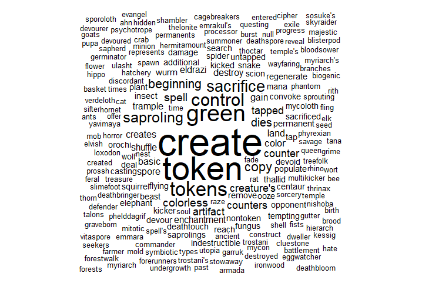
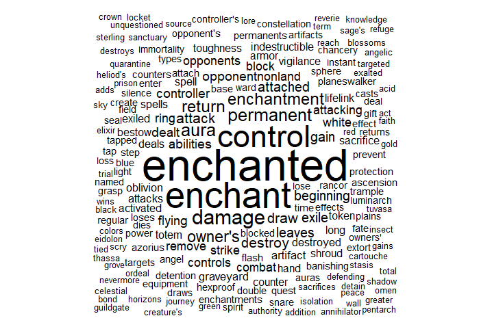
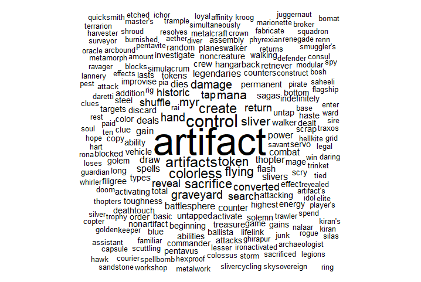
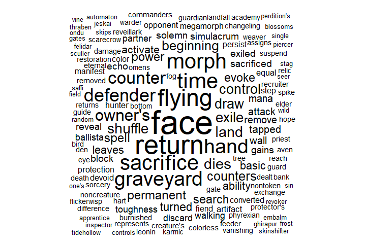
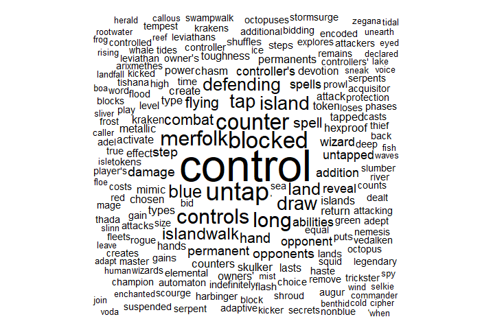

# [MTG-Web-Scraping](https://github.com/MKS310/MTG-Web-Scraping/blob/master/schweihs_text.pdf) 

## Background
My family and I love playing Magic the Gathering, so I created this project for a final exam for an Unstructured Data Analysis Class during my Master's degree program. The goal was to analyze the deck structure of the tournament decks in the current "meta" (a term used to describe the current cards in popular use). I also wanted to analyze the text on the cards since MTG card narratives contain a lot of interesting Fantasy-genre descriptions.


## Introduction
**Magic: the Gathering** is a strategy card game owned by Wizards of the Coast with an estimated 20 million players worldwide as of 2015 [@duffy_2015]. Over 15,000 unique cards [@relikter_2016] have been created for the game. Players can build their own decks using cards that are legal for the format they are playing. For one particular format, called Commander or EDH, almost all 15,000 cards are eligible for inclusion in a player’s deck. 

A commander deck consists of 100 cards, pursuant to the following rules [@mtg_2019]:

+ Each deck must contain exactly 100 cards, including its commander.
+ Other than basic lands, each card in a Commander deck must have a different English name.
+ A card can be included in a Commander deck only if every color in its color identity is also found in the color identity of the deck's commander.

The ecosystem of Commander decks is vast and wild. Players rely on creativity, available resources and tournament deck lists to craft a seemingly infinite variety of decks. Naturally, certain types of decks become popular based on “what everyone else is playing” [@magic_2007] and what everyone is playing to beat everyone else. This is called the metagame. Many websites report deck statistics and metagame analysis. One such website is MTG Goldfish. They derive their metagame analysis from current MTG tournament games. MTGgoldfish.com publishes a list of commander metagame decks, along with the cards in the decks and the prices of the cards. 

A MTG card looks like the following image. Each card has a name, cost, type, and power/toughness. Most cards, with the exception of basic lands, have text. The card text that makes up each Commander deck in the metagame is the interest of this analysis.

 [@magic]

## Motivation

Each card has a rich story. I suspect that by modelling the topics of the text, we can see the story of the current Commander-format metagame. I also suspect that the topics will naturally be grouped by color combination. 

## Related Work

Some work has been done analyzing MTG card text. One study [@Zilio_2018] outlines the methodology used to train neural nets to predict a card type based on imagery. They also trained neural networks to generate card text to match an image.

In addition, several researchers looked into the ability to use artificial intelligence to play MTG. They showed that the games' outcomes were non-computable: "Magic: The Gathering does not fit assumptions commonly made by computer scientists while modeling games. We conjecture that optimal play in Magic is far harder than this result alone implies, and leave the true complexity of Magic and the reconciliation of Magic with existing theories of games for future research," [@churchill2019magic]. The framework of rules that leads to this conclusion is largely buried in the text on each individual card.

## Dataset Description

The dataset is a compilation of Commander deck data scraped from MTGgoldfish.com using a python script (./scripts/mtg_scraper2.py) and an MTG software development kit (sdk).

## Variables

The data is saved as a JSON file and contains the following information: 

+ Deck ID
+ Deck name
+ Number of decks of type reported to MTG Goldfish
+ Percent of Metagame represented by a deck
+ Deck price (paper deck)
+ Deck price (online deck)
+ Cards:
  + Name
  + Mana cost
  + Colors
  + Text

The card colors are related to the flavor of the text. Angels and knights are white; Dragons, volcanos and goblins are red.  In this analysis, the variables of interest are the deck name, the colors, and the text.

## Methodology

The following steps were taken to perform the topic modelling analysis:

### Find the Data
The website and data requirements were analyzed.

  + MTGGoldfish.com is a leading source for MTG tournament deck lists. This is among the best sources for analyzing the current metagame of any MTG format.
  
### Web Scraping with Python

I build a webscraper in Python 3.5 using beautiful soup. The deck data was saved as a JSON file.

### Process Data

The JSON file was loaded into R and processed into a data frame

```
```{r Visualize Color Distribution, echo=FALSE, message=FALSE, warning=FALSE}
#create a dataframe for ggplot to plot
#y value is the sum of the number of decks for each color combo
dfl <- ddply(deck_df, .(color), summarize, y=sum(weight))
#reorder so plot goes from tallest to shortest
dfl <- dfl[order(dfl$y, decreasing = TRUE),]
dfl$color <- factor(dfl$color,levels = dfl$color)
area.color <- rep(NA, length(dfl$color)) #used to color top 5 red
area.color[1:5] <- "red"
a <- ggplot(dfl, aes(x = color,y=y ))   
a + geom_col(aes( fill = area.color), width = 0.5) + 
  ggtitle("Popularity of Deck Colors in Current MTG Commander Metagame") +
  xlab("Color Combinations of Commander Decks (Top 5 indicated in red)") +
  ylab("Number of Decks Reported") +
  theme_bw() +
  theme(axis.text.x = element_text(angle = 90,hjust=0.95,vjust=0.2),
        panel.grid.major = element_blank(), 
        panel.grid.minor = element_blank(),
        panel.background = element_blank(), 
        axis.line = element_line(colour = "black"),
        legend.position = "none")
remove(dfl)
```


Visually determine which are the 5 most popular color combinations. Will the topic model detect these color combinations?

+ Black,Red,Blue
+ Red,Blue
+ Black
+ Green,Blue 
+ Red

```{r top five, message=FALSE, warning=FALSE, include=FALSE}
BRB <- 'Black,Red,Blue'
RB <- 'Red,Blue'
B <- 'Black'
GB <- 'Green,Blue'
R <- 'Red'
top5colors = c(BRB,RB,B,GB,R)
#create deck object with decks of top 5 color combos
deck.obj <- deck_df[which(deck_df$color %in% top5colors),]
```

### Prepare Data

Prepare data for topic modeling using the function ```makeFlexTexChunks``` from Chapter 13 of Jockers' text.

```{r Data prep for topic modelling, message=FALSE, warning=FALSE, include=FALSE}
#Tokenize then chunk the text data and remove special characters 
chunk.size = 1000
topic.m <- NULL
for(i in 1:length(deck.obj$name)) {
  chunk.m <- makeFlexTextChunks(deck.obj$card_text[i],chunk.size,percentage=FALSE)
  textname <- deck.obj$name[i]
  segments.m <- cbind(paste(textname,segment=1:nrow(chunk.m),sep="_"),chunk.m)
  topic.m <- rbind(topic.m,segments.m)
}
documents <- as.data.frame(topic.m,stringsAsFactors=F)
colnames(documents) <- c("id","text")
```

### Simple Topic Modeling

Perform initial simple topic modeling with 33 topics using the stoplist2.csv file as the stoplist. Several MTG specific words were added such as cards, creature, creatures, spell, library, battlefield, etc. \footnote{Output from this point forward is copied and pasted from the Virtual Lab R Studio due to problems installing mallet on my Mac. The code is in the RMD file, set to not run.}

```{r Simple Topic Modeling, eval=FALSE, include=FALSE}
#Stoplist with MTG words added
stoplist <- paste(tdir,"./scripts/stoplist2.csv",sep="")
mallet.instances <- mallet.import(documents$id,documents$text,stoplist,FALSE,
                                  token.regexp="[\\p{L}']+")
topic.model <- MalletLDA(num.topics=33) #33 topics corresponding to the total number of color combinations represented in the data
topic.model$loadDocuments(mallet.instances)
vocabulary <- topic.model$getVocabulary()
```

```{r vlab4, eval=FALSE, message=FALSE, warning=FALSE, include=FALSE}
word.freqs <- mallet.word.freqs(topic.model)
head(word.freqs)
```
  
  |     words| term.freq| doc.freq
---  |--- | --- | ---
1 |    flying|       776|      208
2 | vigilance|      2680|     1091
3 |deathtouch|      1825|      960
4 |  lifelink|      2047|     1025
5 | beginning|     11194|     3158
6 |      step|      5542|     2491

### Train the Model

Set the parameters and train the model

```{r train model in vlab, eval=FALSE, message=FALSE, warning=FALSE, include=FALSE}
topic.model$setAlphaOptimization(40,80)
topic.model$train(400)
```

```
topic.model$setAlphaOptimization(40,80)
topic.model$train(400)
```
### Explore the Model


```{r explor model in vlab, eval=FALSE, message=FALSE, warning=FALSE, include=FALSE}
topic.words.m <- mallet.topic.words(topic.model,smoothed=TRUE,normalized=TRUE)
vocabulary <- topic.model$getVocabulary()
colnames(topic.words.m) <- vocabulary
mallet.top.words(topic.model,topic.words.m[1,],10)
```

**The top ten words in group 1:**


 |words |   weights
--- | --- | ---
create  |     create |0.13426572
token   |      token |0.11429650
green   |      green |0.06896267
tokens  |     tokens |0.05525709
control |    control |0.04719498
sacrifice| sacrifice |0.03634215
saproling |saproling |0.03113279
beginning| beginning |0.02375286
copy    |       copy |0.02300867
dies     |      dies |0.01879157

**The top ten words in group 2:**

  |words |   weights
--- | --- | ---
enchanted |    enchanted |0.08977330
enchant    |     enchant |0.07081737
control   |      control |0.05614461
damage    |       damage |0.02960630
permanent |    permanent |0.02295001
aura      |         aura |0.02251591
enchantment| enchantment |0.02049008
return    |       return |0.02043220
owner's   |      owner's |0.01724876
draw      |         draw |0.01525188


## Visualizations and Findings

```{r Visualize the Topics, eval=FALSE, message=FALSE, warning=FALSE, include=FALSE}
# 13.7 Visualize the Model with Wordcloud
topic.top.words.1 <- mallet.top.words(topic.model,topic.words.m[1,],300)
topic.top.words.2 <- mallet.top.words(topic.model,topic.words.m[2,],300)
topic.top.words.3 <- mallet.top.words(topic.model,topic.words.m[3,],300)
topic.top.words.4 <- mallet.top.words(topic.model,topic.words.m[4,],300)
topic.top.words.5 <- mallet.top.words(topic.model,topic.words.m[5,],300)
wordcloud(topic.top.words.1$words,topic.top.words.1$weights,c(4,.8),rot.per=0,
          random.order=FALSE)
wordcloud(topic.top.words.2$words,topic.top.words.2$weights,c(4,.8),rot.per=0,
          random.order=FALSE)
wordcloud(topic.top.words.3$words,topic.top.words.3$weights,c(4,.8),rot.per=0,
          random.order=FALSE)
wordcloud(topic.top.words.4$words,topic.top.words.4$weights,c(4,.8),rot.per=0,
          random.order=FALSE)
wordcloud(topic.top.words.5$words,topic.top.words.5$weights,c(4,.8),rot.per=0,
          random.order=FALSE)
```

To determine if the topic models separated the text by color, we will look at the topic probability. The colors of the decks decks with a greater than 50% chance of belonging to each topic are represented in the bar chart followed by the topic cloud corresponding to the topic.


```{r Findings, eval=FALSE, message=FALSE, warning=FALSE, include=FALSE}
# 13.8 Topic Probability
doc.topics.m <- mallet.doc.topics(topic.model,smoothed=T,normalized=T)
file.ids.v <- documents[,1]
head(file.ids.v)
file.id.1 <- strsplit(file.ids.v,"_")
file.chunk.id.1 <- lapply(file.id.1,rbind)
file.chunk.id.m <- do.call(rbind,file.chunk.id.1)
head(file.chunk.id.m)
doc.topics.df <- as.data.frame(doc.topics.m)
doc.topics.df <- cbind(file.chunk.id.m[,1],doc.topics.df)
doc.topic.means.df <- aggregate(doc.topics.df[,2:ncol(doc.topics.df)],
                                list(doc.topics.df[,1]),mean)
```

### Topic 1

```{r load vlab df, message=FALSE, warning=FALSE, include=FALSE}
doc.topic.means.df <- readRDS("./doc_topic_means_df")
```



```{r Topic1 vlab, echo=FALSE, message=FALSE, warning=FALSE, fig.height = 3, fig.width = 5, fig.align = "center"}
#TOPIC 1
group1.l <- which(doc.topic.means.df$V1>.5)
filenames <- as.character(doc.topic.means.df[group1.l,"Group.1"])
group_colors <- deck_df$color[which(deck_df$name%in%filenames)]
group_colors <- data.frame(col = group_colors, num = rep(1, length(group_colors)))
group_colors <- group_colors %>% group_by(col) %>% summarize(num = sum(num))
ggplot(group_colors, aes(col, num), y = num)+geom_col()+
  ggtitle("Decks in Topic 1")+
    theme_bw() + xlab("") + ylab("")+
  theme(axis.text.x = element_text(angle = 90,hjust=0.95,vjust=0.2),
        panel.grid.major = element_blank(), 
        panel.grid.minor = element_blank(),
        panel.background = element_blank(), 
        axis.line = element_line(colour = "black"),
        legend.position = "none")
```

This topic consists of mostly mono-colored decks, and predominantly white decks. 

### Topic 2



```{r Topic2 vlab, message=FALSE, warning=FALSE, echo=FALSE, fig.height = 3, fig.width = 5, fig.align = "center"}
#TOPIC 2
group2.l <- which(doc.topic.means.df$V2>.5)
filenames <- as.character(doc.topic.means.df[group2.l,"Group.1"])
group_colors <- deck_df$color[which(deck_df$name%in%filenames)]
group_colors <- data.frame(col = group_colors, num = rep(1, length(group_colors)))
group_colors <- group_colors %>% group_by(col) %>% summarize(num = sum(num))
ggplot(group_colors, aes(col, num), y = num)+
  geom_col()+
  ggtitle("Decks in Topic 2")+
    theme_bw() +xlab("") + ylab("")+
  theme(axis.text.x = element_text(angle = 90,hjust=0.95,vjust=0.2),
        panel.grid.major = element_blank(), 
        panel.grid.minor = element_blank(),
        panel.background = element_blank(), 
        axis.line = element_line(colour = "black"),
        legend.position = "none")
```

Topic 2 is composed of a lot of blue, a color associated with 'control', which can be seen in the wordcloud.

### Topic 3



```{r Topic3 vlab, echo=FALSE, message=FALSE, warning=FALSE, fig.height = 3, fig.width = 5, fig.align = "center"}
#TOPIC 3
group3.l <- which(doc.topic.means.df$V3>.5)
filenames <- as.character(doc.topic.means.df[group3.l,"Group.1"])
group_colors <- deck_df$color[which(deck_df$name%in%filenames)]
group_colors <- data.frame(col = group_colors, num = rep(1, length(group_colors)))
group_colors <- group_colors %>% group_by(col) %>% summarize(num = sum(num))
ggplot(group_colors, aes(col, num), y = num)+
  geom_col()+
  ggtitle("Decks in Topic 3")+
    theme_bw() +xlab("") + ylab("")+
  theme(axis.text.x = element_text(angle = 90,hjust=0.95,vjust=0.2),
        panel.grid.major = element_blank(), 
        panel.grid.minor = element_blank(),
        panel.background = element_blank(), 
        axis.line = element_line(colour = "black"),
        legend.position = "none")
```

Topic 3 consists of mostly 3-colored decks and colorless decks. Colorless is a special type that is often associated with "Artifact" type cards, so it is no surprise to see this represented in the wordcloud. It could also be true that decks with more than two colors utilize alot of artifacts.

### Topic 4



```{r Topic4 vlab, echo=FALSE, message=FALSE, warning=FALSE, fig.height = 3, fig.width = 5, fig.align = "center"}
#TOPIC 4
group4.l <- which(doc.topic.means.df$V4>.5)
filenames <- as.character(doc.topic.means.df[group4.l,"Group.1"])
group_colors <- deck_df$color[which(deck_df$name%in%filenames)]
group_colors <- data.frame(col = group_colors, num = rep(1, length(group_colors)))
group_colors <- group_colors %>% group_by(col) %>% summarize(num = sum(num))
ggplot(group_colors, aes(col, num), y = num)+
  geom_col()+
  ggtitle("Decks in Topic 4")+
    theme_bw() +xlab("") + ylab("")+
  theme(axis.text.x = element_text(angle = 90,hjust=0.95,vjust=0.2),
        panel.grid.major = element_blank(), 
        panel.grid.minor = element_blank(),
        panel.background = element_blank(), 
        axis.line = element_line(colour = "black"),
        legend.position = "none")
```

Suprisingly, in the topic 4 wordcloud, we see the word "graveyard" which is often associated with black. However, one popular game-mechanic is "ressurection" in which things are brought back from the dead (ie., from the graveyard). This may actually be a green, life-giving, mechanic.

### Topic 5



```{r Topic5 vlab, echo=FALSE, message=FALSE, warning=FALSE, fig.height = 3, fig.width = 5, fig.align = "center"}
#TOPIC 5
group5.l <- which(doc.topic.means.df$V5>.5)
filenames <- as.character(doc.topic.means.df[group5.l,"Group.1"])
group_colors <- deck_df$color[which(deck_df$name%in%filenames)]
group_colors <- data.frame(col = group_colors, num = rep(1, length(group_colors)))
group_colors <- group_colors %>% group_by(col) %>% summarize(num = sum(num))
ggplot(group_colors, aes(col, num), y = num)+
  geom_col()+
  ggtitle("Decks in Topic 5")+
    theme_bw() + xlab("") + ylab("")+
  theme(axis.text.x = element_text(angle = 90,hjust=0.95,vjust=0.2),
        panel.grid.major = element_blank(), 
        panel.grid.minor = element_blank(),
        panel.background = element_blank(), 
        axis.line = element_line(colour = "black"),
        legend.position = "none")
```

Topic 5's wordcloud tells the story of the aggressive red deck: control, block, callous, attack, power, champion, etc.

## Discussion & Conclusion

The largest part of the project was building the dataset. There are some great sites online that track cards and deck configurations. I wanted to build a dataset that consisted of deck configurations pulled from the latest tournaments and after contact several web admins for API or database access, I resigned to scraping the data myself. Of course, I checked out the sites' robots.txt files first.

After scraping and formatting the data into a JSON format, I enriched the data using an API that provided more information about each individual card. 

[The Jupyter Notebook](https://github.com/MKS310/MTG-Web-Scraping/beautiful_soup_demo.ipynb) for this project was created as a demo of the web scraping portion.
I gave this demo to the Python Users Group at my corporate job to demonstrate some web scraping ideas.


After modeling deck data for the current Commander-format metagame, patterns and stories emerged and could be seen in the wordclouds. There is room for further exploration into this dataset. The data collected from MTGgoldfish could be used to analyze the network of cards, connected to each other via decks.

## [References](https://github.com/MKS310/MTG-Web-Scraping/blob/master/schweihs_text.bib)


